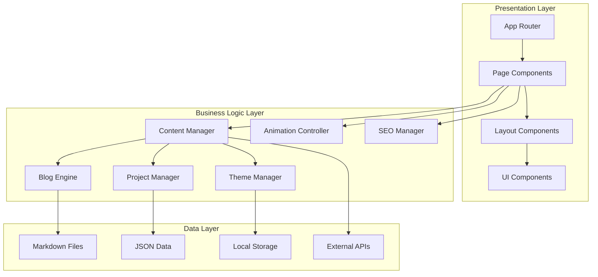

# Design Document: Portfolio Modernization

## Overview

This design document outlines the technical architecture and implementation approach for modernizing a React TypeScript portfolio website. The system will transform an existing portfolio into a production-ready, feature-rich application with advanced routing, content management, animations, accessibility, and performance optimizations.

The portfolio maintains its existing tech stack (React 19, TypeScript, Vite, TailwindCSS, Framer Motion) while adding react-router-dom for routing, react-helmet-async for SEO, react-markdown for blog content, and additional libraries for enhanced functionality.

### Key Design Principles

1. **Component Modularity**: All features implemented as reusable, composable components
2. **Type Safety**: Comprehensive TypeScript types throughout the application
3. **Performance First**: Code splitting, lazy loading, and optimization at every layer
4. **Accessibility by Default**: WCAG AA compliance built into all components
5. **Progressive Enhancement**: Core functionality works without JavaScript, enhanced with it
6. **Mobile-First**: Responsive design starting from mobile breakpoints
7. **Maintainability**: Clean code structure with clear separation of concerns

## Architecture

### High-Level Architecture



### Directory Structure

```
src/
├── components/
│   ├── layout/
│   │   ├── Header.tsx
│   │   ├── Footer.tsx
│   │   ├── Layout.tsx
│   │   └── Breadcrumbs.tsx
│   ├── ui/
│   │   ├── Button.tsx
│   │   ├── Card.tsx
│   │   ├── Modal.tsx
│   │   ├── Toast.tsx
│   │   ├── Skeleton.tsx
│   │   ├── Lightbox.tsx
│   │   └── ProgressBar.tsx
│   ├── sections/
│   │   ├── Hero.tsx
│   │   ├── TechStack.tsx
│   │   ├── Projects.tsx
│   │   ├── Blog.tsx
│   │   ├── Contact.tsx
│   │   ├── Testimonials.tsx
│   │   ├── Skills.tsx
│   │   └── Timeline.tsx
│   └── features/
│       ├── blog/
│       │   ├── BlogList.tsx
│       │   ├── BlogCard.tsx
│       │   ├── BlogDetail.tsx
│       │   ├── BlogFilter.tsx
│       │   └── ShareButtons.tsx
│       ├── projects/
│       │   ├── ProjectCard.tsx
│       │   ├── ProjectDetail.tsx
│       │   └── ProjectFilter.tsx
│       └── theme/
│           ├── ThemeToggle.tsx
│           └── ThemeProvider.tsx
├── pages/
│   ├── Home.tsx
│   ├── About.tsx
│   ├── BlogListPage.tsx
│   ├── BlogDetailPage.tsx
│   ├── ProjectDetailPage.tsx
│   └── NotFound.tsx
├── hooks/
│   ├── useTheme.ts
│   ├── useScrollAnimation.ts
│   ├── useIntersectionObserver.ts
│   ├── useLocalStorage.ts
│   └── useMediaQuery.ts
├── utils/
│   ├── markdown.ts
│   ├── seo.ts
│   ├── analytics.ts
│   ├── readingTime.ts
│   └── imageOptimization.ts
├── data/
│   ├── projects.json
│   ├── skills.json
│   ├── testimonials.json
│   └── timeline.json
├── content/
│   └── blog/
│       ├── post-1.md
│       ├── post-2.md
│       └── ...
├── types/
│   ├── blog.ts
│   ├── project.ts
│   ├── theme.ts
│   └── common.ts
├── contexts/
│   ├── ThemeContext.tsx
│   └── ToastContext.tsx
├── router/
│   └── AppRouter.tsx
└── App.tsx
```

## Components and Interfaces

### Core Type Definitions

```typescript
// types/blog.ts
interface BlogPost {
  id: string;
  slug: string;
  title: string;
  excerpt: string;
  content: string;
  author: string;
  publishDate: Date;
  updatedDate?: Date;
  tags: string[];
  category: string;
  coverImage: string;
  readingTime: number;
}

interface BlogFrontmatter {
  title: string;
  date: string;
  excerpt: string;
  tags: string[];
  category: string;
  coverImage: string;
}

// types/project.ts
interface Project {
  id: string;
  slug: string;
  title: string;
  shortDescription: string;
  fullDescription: string;
  thumbnail: string;
  images: string[];
  techStack: string[];
  challenges: string[];
  solutions: string[];
  liveUrl?: string;
  githubUrl?: string;
  featured: boolean;
}

// types/theme.ts
type Theme = 'dark' | 'light';

interface ThemeColors {
  background: string;
  foreground: string;
  primary: string;
  secondary: string;
  accent: string;
  muted: string;
}

// types/common.ts
interface SEOMetadata {
  title: string;
  description: string;
  keywords: string[];
  ogImage?: string;
  ogType?: string;
  canonicalUrl?: string;
}

interface Testimonial {
  id: string;
  name: string;
  role: string;
  company: string;
  avatar: string;
  content: string;
  rating: number;
}

interface Skill {
  name: string;
  category: string;
  proficiency: number;
  icon?: string;
}

interface TimelineItem {
  id: string;
  title: string;
  organization: string;
  startDate: Date;
  endDate?: Date;
  description: string;
  type: 'work' | 'education' | 'certification';
}

interface GitHubActivity {
  id: string;
  type: string;
  repo: string;
  message: string;
  timestamp: Date;
  url: string;
}
```

### Router Configuration

```typescript
// router/AppRouter.tsx
import { BrowserRouter, Routes, Route } from 'react-router-dom';
import { lazy, Suspense } from 'react';
import Layout from '../components/layout/Layout';
import LoadingSpinner from '../components/ui/LoadingSpinner';

// Lazy load pages for code splitting
const Home = lazy(() => import('../pages/Home'));
const About = lazy(() => import('../pages/About'));
const BlogListPage = lazy(() => import('../pages/BlogListPage'));
const BlogDetailPage = lazy(() => import('../pages/BlogDetailPage'));
const ProjectDetailPage = lazy(() => import('../pages/ProjectDetailPage'));
const NotFound = lazy(() => import('../pages/NotFound'));

export const AppRouter = () => {
  return (
    <BrowserRouter>
      <Suspense fallback={<LoadingSpinner />}>
        <Routes>
          <Route path="/" element={<Layout />}>
            <Route index element={<Home />} />
            <Route path="about" element={<About />} />
            <Route path="blog" element={<BlogListPage />} />
            <Route path="blog/:slug" element={<BlogDetailPage />} />
            <Route path="projects/:slug" element={<ProjectDetailPage />} />
            <Route path="*" element={<NotFound />} />
          </Route>
        </Routes>
      </Suspense>
    </BrowserRouter>
  );
};
```

### Theme Management System

```typescript
// contexts/ThemeContext.tsx
interface ThemeContextType {
  theme: Theme;
  toggleTheme: () => void;
  colors: ThemeColors;
}

const ThemeContext = createContext<ThemeContextType | undefined>(undefined);

export const ThemeProvider = ({ children }: { children: ReactNode }) => {
  const [theme, setTheme] = useState<Theme>(() => {
    const stored = localStorage.getItem('theme');
    return (stored as Theme) || 'dark';
  });

  const toggleTheme = () => {
    setTheme(prev => {
      const newTheme = prev === 'dark' ? 'light' : 'dark';
      localStorage.setItem('theme', newTheme);
      return newTheme;
    });
  };

  const colors = getThemeColors(theme);

  useEffect(() => {
    document.documentElement.setAttribute('data-theme', theme);
  }, [theme]);

  return (
    <ThemeContext.Provider value={{ theme, toggleTheme, colors }}>
      {children}
    </ThemeContext.Provider>
  );
};

// hooks/useTheme.ts
export const useTheme = () => {
  const context = useContext(ThemeContext);
  if (!context) {
    throw new Error('useTheme must be used within ThemeProvider');
  }
  return context;
};
```

### Blog Engine Implementation

```typescript
// utils/markdown.ts
import matter from 'gray-matter';
import { remark } from 'remark';
import html from 'remark-html';
import prism from 'remark-prism';

export const parseMarkdown = async (content: string): Promise<{
  frontmatter: BlogFrontmatter;
  html: string;
}> => {
  const { data, content: markdown } = matter(content);
  
  const processedContent = await remark()
    .use(html)
    .use(prism)
    .process(markdown);
  
  return {
    frontmatter: data as BlogFrontmatter,
    html: processedContent.toString()
  };
};

export const calculateReadingTime = (content: string): number => {
  const wordsPerMinute = 200;
  const wordCount = content.trim().split(/\s+/).length;
  return Math.ceil(wordCount / wordsPerMinute);
};

// Blog content loader
export const loadBlogPosts = async (): Promise<BlogPost[]> => {
  const blogFiles = import.meta.glob('../content/blog/*.md', { as: 'raw' });
  const posts: BlogPost[] = [];
  
  for (const [path, loader] of Object.entries(blogFiles)) {
    const content = await loader();
    const { frontmatter, html } = await parseMarkdown(content);
    const slug = path.split('/').pop()?.replace('.md', '') || '';
    
    posts.push({
      id: slug,
      slug,
      title: frontmatter.title,
      excerpt: frontmatter.excerpt,
      content: html,
      author: 'Portfolio Owner',
      publishDate: new Date(frontmatter.date),
      tags: frontmatter.tags,
      category: frontmatter.category,
      coverImage: frontmatter.coverImage,
      readingTime: calculateReadingTime(content)
    });
  }
  
  return posts.sort((a, b) => 
    b.publishDate.getTime() - a.publishDate.getTime()
  );
};
```

### Animation Controller

```typescript
// Animation variants for Framer Motion
export const pageTransitionVariants = {
  initial: { opacity: 0, y: 20 },
  animate: { opacity: 1, y: 0 },
  exit: { opacity: 0, y: -20 }
};

export const staggerContainerVariants = {
  animate: {
    transition: {
      staggerChildren: 0.1
    }
  }
};

export const fadeInUpVariants = {
  initial: { opacity: 0, y: 60 },
  animate: { 
    opacity: 1, 
    y: 0,
    transition: { duration: 0.6, ease: 'easeOut' }
  }
};

export const scaleInVariants = {
  initial: { opacity: 0, scale: 0.8 },
  animate: { 
    opacity: 1, 
    scale: 1,
    transition: { duration: 0.4 }
  }
};

// hooks/useScrollAnimation.ts
export const useScrollAnimation = () => {
  const controls = useAnimation();
  const [ref, inView] = useInView({
    threshold: 0.2,
    triggerOnce: true
  });

  useEffect(() => {
    if (inView) {
      controls.start('animate');
    }
  }, [controls, inView]);

  return { ref, controls };
};
```

### SEO Manager

```typescript
// utils/seo.ts
import { Helmet } from 'react-helmet-async';

interface SEOProps extends SEOMetadata {
  article?: {
    publishedTime: string;
    author: string;
    tags: string[];
  };
}

export const SEO = ({
  title,
  description,
  keywords,
  ogImage,
  ogType = 'website',
  canonicalUrl,
  article
}: SEOProps) => {
  const siteUrl = 'https://yourportfolio.com';
  const fullTitle = `${title} | Portfolio`;
  const imageUrl = ogImage || `${siteUrl}/og-default.jpg`;
  const url = canonicalUrl || siteUrl;

  return (
    <Helmet>
      {/* Basic Meta Tags */}
      <title>{fullTitle}</title>
      <meta name="description" content={description} />
      <meta name="keywords" content={keywords.join(', ')} />
      <link rel="canonical" href={url} />

      {/* Open Graph */}
      <meta property="og:type" content={ogType} />
      <meta property="og:title" content={fullTitle} />
      <meta property="og:description" content={description} />
      <meta property="og:image" content={imageUrl} />
      <meta property="og:url" content={url} />

      {/* Twitter Card */}
      <meta name="twitter:card" content="summary_large_image" />
      <meta name="twitter:title" content={fullTitle} />
      <meta name="twitter:description" content={description} />
      <meta name="twitter:image" content={imageUrl} />

      {/* Article Meta (for blog posts) */}
      {article && (
        <>
          <meta property="article:published_time" content={article.publishedTime} />
          <meta property="article:author" content={article.author} />
          {article.tags.map(tag => (
            <meta key={tag} property="article:tag" content={tag} />
          ))}
        </>
      )}
    </Helmet>
  );
};
```

### Accessibility Layer

```typescript
// components/ui/Modal.tsx
interface ModalProps {
  isOpen: boolean;
  onClose: () => void;
  title: string;
  children: ReactNode;
}

export const Modal = ({ isOpen, onClose, title, children }: ModalProps) => {
  const modalRef = useRef<HTMLDivElement>(null);
  const previousFocusRef = useRef<HTMLElement | null>(null);

  useEffect(() => {
    if (isOpen) {
      previousFocusRef.current = document.activeElement as HTMLElement;
      modalRef.current?.focus();
    } else {
      previousFocusRef.current?.focus();
    }
  }, [isOpen]);

  useEffect(() => {
    const handleEscape = (e: KeyboardEvent) => {
      if (e.key === 'Escape' && isOpen) {
        onClose();
      }
    };

    document.addEventListener('keydown', handleEscape);
    return () => document.removeEventListener('keydown', handleEscape);
  }, [isOpen, onClose]);

  if (!isOpen) return null;

  return (
    <div
      className="modal-overlay"
      role="dialog"
      aria-modal="true"
      aria-labelledby="modal-title"
      onClick={onClose}
    >
      <div
        ref={modalRef}
        className="modal-content"
        onClick={e => e.stopPropagation()}
        tabIndex={-1}
      >
        <h2 id="modal-title">{title}</h2>
        {children}
        <button
          onClick={onClose}
          aria-label="Close modal"
          className="modal-close"
        >
          ×
        </button>
      </div>
    </div>
  );
};

// Focus trap implementation
export const useFocusTrap = (ref: RefObject<HTMLElement>, isActive: boolean) => {
  useEffect(() => {
    if (!isActive || !ref.current) return;

    const focusableElements = ref.current.querySelectorAll(
      'button, [href], input, select, textarea, [tabindex]:not([tabindex="-1"])'
    );
    
    const firstElement = focusableElements[0] as HTMLElement;
    const lastElement = focusableElements[focusableElements.length - 1] as HTMLElement;

    const handleTab = (e: KeyboardEvent) => {
      if (e.key !== 'Tab') return;

      if (e.shiftKey) {
        if (document.activeElement === firstElement) {
          e.preventDefault();
          lastElement.focus();
        }
      } else {
        if (document.activeElement === lastElement) {
          e.preventDefault();
          firstElement.focus();
        }
      }
    };

    document.addEventListener('keydown', handleTab);
    return () => document.removeEventListener('keydown', handleTab);
  }, [ref, isActive]);
};
```

### Performance Optimization Layer

```typescript
// Image optimization component
interface OptimizedImageProps {
  src: string;
  alt: string;
  width?: number;
  height?: number;
  className?: string;
  loading?: 'lazy' | 'eager';
}

export const OptimizedImage = ({
  src,
  alt,
  width,
  height,
  className,
  loading = 'lazy'
}: OptimizedImageProps) => {
  const [isLoaded, setIsLoaded] = useState(false);
  const [imageSrc, setImageSrc] = useState<string>('');

  useEffect(() => {
    // Generate WebP version if supported
    const img = new Image();
    const webpSrc = src.replace(/\.(jpg|jpeg|png)$/, '.webp');
    
    img.onload = () => {
      setImageSrc(webpSrc);
      setIsLoaded(true);
    };
    
    img.onerror = () => {
      setImageSrc(src);
      setIsLoaded(true);
    };
    
    img.src = webpSrc;
  }, [src]);

  return (
    <div className={`image-container ${className}`}>
      {!isLoaded && <div className="image-skeleton" />}
       setIsLoaded(true)}
      />
    </div>
  );
};

// Code splitting utility
export const lazyLoadComponent = (
  importFunc: () => Promise<{ default: ComponentType<any> }>
) => {
  return lazy(() => 
    importFunc().catch(() => ({
      default: () => <div>Error loading component</div>
    }))
  );
};
```

### Toast Notification System

```typescript
// contexts/ToastContext.tsx
interface Toast {
  id: string;
  message: string;
  type: 'success' | 'error' | 'info' | 'warning';
  duration?: number;
}

interface ToastContextType {
  showToast: (message: string, type: Toast['type'], duration?: number) => void;
  hideToast: (id: string) => void;
}

export const ToastProvider = ({ children }: { children: ReactNode }) => {
  const [toasts, setToasts] = useState<Toast[]>([]);

  const showToast = (message: string, type: Toast['type'], duration = 3000) => {
    const id = Math.random().toString(36).substr(2, 9);
    const toast: Toast = { id, message, type, duration };
    
    setToasts(prev => [...prev, toast]);

    if (duration > 0) {
      setTimeout(() => hideToast(id), duration);
    }
  };

  const hideToast = (id: string) => {
    setToasts(prev => prev.filter(toast => toast.id !== id));
  };

  return (
    <ToastContext.Provider value={{ showToast, hideToast }}>
      {children}
      <div className="toast-container" aria-live="polite">
        {toasts.map(toast => (
          <motion.div
            key={toast.id}
            initial={{ opacity: 0, y: 50 }}
            animate={{ opacity: 1, y: 0 }}
            exit={{ opacity: 0, y: 50 }}
            className={`toast toast-${toast.type}`}
            role="alert"
          >
            {toast.message}
            <button
              onClick={() => hideToast(toast.id)}
              aria-label="Close notification"
            >
              ×
            </button>
          </motion.div>
        ))}
      </div>
    </ToastContext.Provider>
  );
};
```

## Data Models

### Content Data Structure

```typescript
// data/projects.json
{
  "projects": [
    {
      "id": "project-1",
      "slug": "ecommerce-platform",
      "title": "E-Commerce Platform",
      "shortDescription": "Full-stack e-commerce solution with React and Node.js",
      "fullDescription": "A comprehensive e-commerce platform featuring...",
      "thumbnail": "/images/projects/ecommerce-thumb.jpg",
      "images": [
        "/images/projects/ecommerce-1.jpg",
        "/images/projects/ecommerce-2.jpg"
      ],
      "techStack": ["React", "TypeScript", "Node.js", "PostgreSQL", "Stripe"],
      "challenges": [
        "Implementing real-time inventory management",
        "Handling payment processing securely"
      ],
      "solutions": [
        "Used WebSocket for real-time updates",
        "Integrated Stripe with PCI compliance"
      ],
      "liveUrl": "https://demo.example.com",
      "githubUrl": "https://github.com/user/project",
      "featured": true
    }
  ]
}

// content/blog/example-post.md
---
title: "Building Scalable React Applications"
date: "2024-01-15"
excerpt: "Learn best practices for building large-scale React applications"
tags: ["React", "TypeScript", "Architecture"]
category: "Web Development"
coverImage: "/images/blog/react-scalable.jpg"
---

# Building Scalable React Applications

Content goes here with markdown formatting...

## Code Example

```typescript
const example = () => {
  return <div>Hello World</div>;
};
```
```

### Local Storage Schema

```typescript
// Theme preference
localStorage.setItem('theme', 'dark' | 'light');

// User preferences
interface UserPreferences {
  theme: Theme;
  reducedMotion: boolean;
  analyticsConsent: boolean;
}

localStorage.setItem('preferences', JSON.stringify(preferences));

// Cached data
interface CachedData {
  githubActivity: GitHubActivity[];
  timestamp: number;
  expiresIn: number;
}

localStorage.setItem('cache:github', JSON.stringify(cachedData));
```

### PWA Configuration

```typescript
// public/manifest.json
{
  "name": "Portfolio - Your Name",
  "short_name": "Portfolio",
  "description": "Professional portfolio showcasing projects and blog",
  "start_url": "/",
  "display": "standalone",
  "background_color": "#0a0a0a",
  "theme_color": "#10b981",
  "icons": [
    {
      "src": "/icons/icon-192.png",
      "sizes": "192x192",
      "type": "image/png"
    },
    {
      "src": "/icons/icon-512.png",
      "sizes": "512x512",
      "type": "image/png"
    }
  ]
}

// Service Worker strategy
const CACHE_NAME = 'portfolio-v1';
const urlsToCache = [
  '/',
  '/about',
  '/blog',
  '/styles/main.css',
  '/scripts/main.js'
];

self.addEventListener('install', (event) => {
  event.waitUntil(
    caches.open(CACHE_NAME)
      .then(cache => cache.addAll(urlsToCache))
  );
});

self.addEventListener('fetch', (event) => {
  event.respondWith(
    caches.match(event.request)
      .then(response => response || fetch(event.request))
  );
});
```


## Correctness Properties

*A property is a characteristic or behavior that should hold true across all valid executions of a system—essentially, a formal statement about what the system should do. Properties serve as the bridge between human-readable specifications and machine-verifiable correctness guarantees.*

### Routing and Navigation Properties

**Property 1: Navigation preserves SPA behavior**
*For any* navigation link click, the application should transition to the target page without triggering a full page reload, maintaining application state.
**Validates: Requirements 1.2**

**Property 2: Invalid routes display 404**
*For any* URL that doesn't match configured routes, the Router should display the 404 page.
**Validates: Requirements 1.3, 16.1**

**Property 3: Browser history integration**
*For any* sequence of navigation actions, using browser back/forward buttons should navigate through the history in the correct order.
**Validates: Requirements 1.4**

**Property 4: Route changes reset scroll position**
*For any* route transition, the page should scroll to the top (scroll position = 0).
**Validates: Requirements 1.5**

**Property 5: Document title updates with routes**
*For any* route, the document.title should be set to the appropriate page title.
**Validates: Requirements 1.6**

### Blog System Properties

**Property 6: Blog list displays all required fields**
*For any* blog post in the list, the rendered output should contain title, excerpt, date, reading time, and tags.
**Validates: Requirements 2.1**

**Property 7: Markdown parsing preserves content structure**
*For any* valid markdown content, parsing and rendering should preserve headings, paragraphs, lists, links, and code blocks.
**Validates: Requirements 2.3**

**Property 8: Reading time calculation accuracy**
*For any* blog post content, the calculated reading time should equal ceil(word_count / 200) minutes.
**Validates: Requirements 2.4**

**Property 9: Category filtering correctness**
*For any* category filter applied, all returned blog posts should have that category, and no posts with that category should be excluded.
**Validates: Requirements 2.5**

**Property 10: Search filtering correctness**
*For any* search query, all returned blog posts should contain the query string in either the title or content (case-insensitive).
**Validates: Requirements 2.6**

**Property 11: Code block syntax highlighting**
*For any* markdown content containing code blocks with language specification, the rendered HTML should include syntax highlighting classes.
**Validates: Requirements 2.8**

### Project Showcase Properties

**Property 12: Project cards display required fields**
*For any* project in the showcase, the rendered card should contain title, description, thumbnail, and tech stack tags.
**Validates: Requirements 3.1**

**Property 13: Project detail pages display all sections**
*For any* project detail page, the rendered output should contain screenshots, full description, tech stack, challenges, and solutions sections.
**Validates: Requirements 3.3**

**Property 14: Project links are rendered when available**
*For any* project with liveUrl or githubUrl defined, the corresponding links should be present in the rendered output.
**Validates: Requirements 3.4**

**Property 15: Technology filtering correctness**
*For any* technology filter applied, all returned projects should include that technology in their techStack array.
**Validates: Requirements 3.5**

### Animation Properties

**Property 16: Page transitions apply animations**
*For any* route change, the Animation_Controller should apply transition animation classes to the page component.
**Validates: Requirements 4.1**

**Property 17: Scroll animations trigger on viewport entry**
*For any* element with scroll animation configuration, entering the viewport should trigger the animation (add animation classes).
**Validates: Requirements 4.2**

**Property 18: Hover interactions apply animations**
*For any* interactive element with hover animations, the hover state should apply animation classes.
**Validates: Requirements 4.3**

**Property 19: Parallax effects respond to scroll**
*For any* element with parallax configuration, scroll position changes should update the element's transform property proportionally.
**Validates: Requirements 4.5**

### Theme Management Properties

**Property 20: Theme persistence round-trip**
*For any* theme selection, setting the theme should persist it to localStorage, and reinitializing the application should load that same theme.
**Validates: Requirements 5.1, 5.4**

**Property 21: Theme toggle alternates themes**
*For any* current theme state, toggling twice should return to the original theme (idempotence).
**Validates: Requirements 5.3**

**Property 22: Theme changes update CSS variables**
*For any* theme change, all CSS custom properties (--color-*) should be updated to match the new theme's color values.
**Validates: Requirements 5.6**

### SEO and Meta Tags Properties

**Property 23: Pages have required meta tags**
*For any* page route, the rendered HTML head should contain title, description, keywords, og:title, og:description, og:image, og:url, twitter:card, twitter:title, twitter:description, and twitter:image meta tags.
**Validates: Requirements 6.1, 6.2, 6.3**

**Property 24: Blog posts have article meta tags**
*For any* blog detail page, the rendered HTML head should additionally contain article:published_time, article:author, and article:tag meta tags.
**Validates: Requirements 6.4**

**Property 25: RSS feed contains all blog posts**
*For any* blog post in the system, it should appear in the generated RSS feed with title, link, description, and pubDate.
**Validates: Requirements 6.7**

### Accessibility Properties

**Property 26: Interactive elements have focus indicators**
*For any* interactive element (button, link, input), applying focus should result in visible focus styling (outline or ring).
**Validates: Requirements 8.1**

**Property 27: Tab navigation follows DOM order**
*For any* page, pressing Tab repeatedly should move focus through interactive elements in the order they appear in the DOM.
**Validates: Requirements 8.2**

**Property 28: Modal focus trap**
*For any* open modal, pressing Tab should cycle focus only among elements within the modal, never escaping to elements outside.
**Validates: Requirements 8.3**

**Property 29: Modal focus restoration**
*For any* modal interaction, opening then closing the modal should return focus to the element that triggered the modal.
**Validates: Requirements 8.4**

**Property 30: Interactive elements have ARIA attributes**
*For any* interactive element, the rendered HTML should include appropriate ARIA role, aria-label, or aria-labelledby attributes.
**Validates: Requirements 8.5**

**Property 31: Images have alt text**
*For any* img element rendered, it should have a non-empty alt attribute.
**Validates: Requirements 8.6**

**Property 32: Color contrast meets WCAG AA**
*For any* text/background color combination used in the application, the contrast ratio should be at least 4.5:1 for normal text or 3:1 for large text.
**Validates: Requirements 8.8**

### Performance and Loading Properties

**Property 33: Below-fold images lazy load**
*For any* image initially positioned below the viewport, it should have loading="lazy" attribute and should not load until scrolled into view.
**Validates: Requirements 9.2**

**Property 34: Below-fold components lazy load**
*For any* heavy component initially below the viewport, it should be wrapped in React.lazy() and should not load until needed.
**Validates: Requirements 9.3**

### UI Feedback Properties

**Property 35: Loading states display skeletons**
*For any* content in loading state, skeleton loaders matching the content structure should be displayed.
**Validates: Requirements 10.1**

**Property 36: Actions trigger appropriate toasts**
*For any* user action (form submission, error), a toast notification with appropriate type (success/error) and message should be displayed.
**Validates: Requirements 10.2, 10.3**

**Property 37: Back-to-top button visibility**
*For any* scroll position greater than 300px from top, the back-to-top button should be visible; otherwise it should be hidden.
**Validates: Requirements 10.4**

**Property 38: Back-to-top button scrolls to top**
*For any* scroll position, clicking the back-to-top button should animate scroll position to 0.
**Validates: Requirements 10.5**

**Property 39: Reading progress accuracy**
*For any* blog detail page scroll position, the reading progress percentage should equal (scrollTop / (scrollHeight - clientHeight)) * 100.
**Validates: Requirements 10.6**

**Property 40: Image clicks open lightbox**
*For any* clickable image in project or blog content, clicking should open the lightbox with that image displayed.
**Validates: Requirements 10.7, 18.3**

**Property 41: Detail pages show breadcrumbs**
*For any* blog detail or project detail page, breadcrumb navigation should be rendered showing the path from home to current page.
**Validates: Requirements 10.8**

### Resume Download Properties

**Property 42: Resume download triggers file download**
*For any* click on the resume download button, a file download should be initiated with Content-Type: application/pdf.
**Validates: Requirements 11.1**

**Property 43: Resume filename format**
*For any* resume download, the filename should match the pattern: {FirstName}_{LastName}_Resume.pdf.
**Validates: Requirements 11.2**

### Contact Form Properties

**Property 44: Form validation correctness**
*For any* form submission, validation should pass if and only if all required fields are non-empty and email field matches email regex pattern.
**Validates: Requirements 12.1, 12.6**

**Property 45: Invalid fields show errors**
*For any* form field that fails validation, a field-specific error message should be displayed adjacent to that field.
**Validates: Requirements 12.2**

**Property 46: Successful submission clears form**
*For any* successful form submission, all form input values should be reset to empty strings.
**Validates: Requirements 12.4**

**Property 47: Submitting form disables button**
*For any* form in submitting state, the submit button should have disabled attribute and display loading indicator.
**Validates: Requirements 12.5**

### Content Management Properties

**Property 48: Project data loads from JSON**
*For any* project defined in projects.json, it should appear in the projects list with all fields correctly mapped.
**Validates: Requirements 13.1, 13.3**

**Property 49: Blog posts load from markdown files**
*For any* .md file in the content/blog directory, it should appear in the blog list after parsing frontmatter and content.
**Validates: Requirements 13.2, 13.4**

**Property 50: Frontmatter parsing correctness**
*For any* markdown file with YAML frontmatter, the parsed metadata should match the frontmatter key-value pairs.
**Validates: Requirements 13.5**

### Additional Sections Properties

**Property 51: Skills grouped by category**
*For any* skills data, the rendered skills section should group skills by their category field.
**Validates: Requirements 14.1**

**Property 52: Timeline items ordered chronologically**
*For any* timeline data, items should be rendered in descending order by startDate (most recent first).
**Validates: Requirements 14.2**

**Property 53: Certifications display all fields**
*For any* certification, the rendered output should contain name, issuing organization, and date.
**Validates: Requirements 14.3**

**Property 54: Testimonials display all fields**
*For any* testimonial, the rendered output should contain name, role, company, photo, and content.
**Validates: Requirements 14.4, 14.5**

### Error Handling Properties

**Property 55: Error boundaries catch component errors**
*For any* component that throws an error during rendering, the error boundary should catch it and display the error UI instead of crashing the app.
**Validates: Requirements 16.3**

**Property 56: API errors display user-friendly messages**
*For any* failed API request, a user-friendly error message should be displayed (not raw error objects or stack traces).
**Validates: Requirements 16.4**

### Analytics Properties

**Property 57: Page views trigger analytics events**
*For any* route change, an analytics page view event should be triggered with the page path.
**Validates: Requirements 17.2**

**Property 58: External link clicks trigger events**
*For any* click on a link with external URL (href starting with http:// or https://), an analytics click event should be triggered.
**Validates: Requirements 17.3**

**Property 59: Form submissions trigger conversion events**
*For any* successful form submission, an analytics conversion event should be triggered with the form name.
**Validates: Requirements 17.4**

**Property 60: Analytics respect user preferences**
*For any* analytics event, if user has disabled analytics in preferences, no event should be sent to analytics service.
**Validates: Requirements 17.5**

### Image Optimization Properties

**Property 61: Images use WebP with fallback**
*For any* image, the system should attempt to load WebP format first, falling back to original format if WebP fails.
**Validates: Requirements 18.1**

**Property 62: Responsive images match viewport**
*For any* image, the loaded image size should be appropriate for the current viewport width (not loading desktop images on mobile).
**Validates: Requirements 18.2**

**Property 63: Gallery keyboard navigation**
*For any* open gallery, pressing arrow keys should navigate to previous/next images.
**Validates: Requirements 18.4**

**Property 64: Gallery displays captions**
*For any* image in the gallery with a caption defined, the caption should be displayed below the image.
**Validates: Requirements 18.5**

**Property 65: Images show placeholders while loading**
*For any* image that hasn't finished loading, a blur-up placeholder should be displayed in its place.
**Validates: Requirements 18.6**

### GitHub Integration Properties

**Property 66: GitHub activity fetches on page load**
*For any* Home or About page load, an API request to GitHub should be initiated to fetch recent activity.
**Validates: Requirements 19.1**

**Property 67: GitHub activity displays all fields**
*For any* GitHub activity item, the rendered output should contain repository name, commit message/action, and timestamp.
**Validates: Requirements 19.2**

**Property 68: GitHub API failure shows fallback**
*For any* failed GitHub API request, cached data should be displayed if available, otherwise a graceful fallback message.
**Validates: Requirements 19.3**

**Property 69: GitHub activity limited to 5 items**
*For any* GitHub activity data, only the 5 most recent items should be displayed.
**Validates: Requirements 19.4**

**Property 70: GitHub activity links open in new tab**
*For any* GitHub activity item click, the repository URL should open in a new browser tab (target="_blank").
**Validates: Requirements 19.5**

### Responsive Design Properties

**Property 71: Layout adapts to viewport size**
*For any* viewport width, the layout should use the appropriate responsive breakpoint styles (mobile: <768px, tablet: 768-1024px, desktop: >1024px).
**Validates: Requirements 20.1, 20.2, 20.3**

**Property 72: Gallery supports swipe gestures**
*For any* open gallery on touch device, swipe left/right gestures should navigate to next/previous images.
**Validates: Requirements 20.4**

**Property 73: Responsive transitions are smooth**
*For any* viewport resize that crosses a breakpoint, layout changes should be animated with CSS transitions.
**Validates: Requirements 20.5**

**Property 74: Touch targets meet minimum size**
*For any* interactive element on mobile viewport (<768px), the touch target should be at least 44x44 pixels.
**Validates: Requirements 20.6**

## Error Handling

### Error Boundary Implementation

```typescript
// components/ErrorBoundary.tsx
interface ErrorBoundaryState {
  hasError: boolean;
  error: Error | null;
}

export class ErrorBoundary extends Component<
  { children: ReactNode },
  ErrorBoundaryState
> {
  constructor(props: { children: ReactNode }) {
    super(props);
    this.state = { hasError: false, error: null };
  }

  static getDerivedStateFromError(error: Error): ErrorBoundaryState {
    return { hasError: true, error };
  }

  componentDidCatch(error: Error, errorInfo: ErrorInfo) {
    console.error('Error caught by boundary:', error, errorInfo);
    // Log to error tracking service
  }

  render() {
    if (this.state.hasError) {
      return (
        <div className="error-boundary">
          <h1>Something went wrong</h1>
          <p>We're sorry for the inconvenience. Please try refreshing the page.</p>
          <button onClick={() => this.setState({ hasError: false, error: null })}>
            Try Again
          </button>
        </div>
      );
    }

    return this.props.children;
  }
}
```

### API Error Handling

```typescript
// utils/api.ts
export const handleApiError = (error: unknown): string => {
  if (error instanceof Error) {
    // Network errors
    if (error.message.includes('fetch')) {
      return 'Unable to connect. Please check your internet connection.';
    }
    
    // Timeout errors
    if (error.message.includes('timeout')) {
      return 'Request timed out. Please try again.';
    }
    
    return 'An unexpected error occurred. Please try again later.';
  }
  
  return 'Something went wrong. Please try again.';
};

export const fetchWithErrorHandling = async <T>(
  url: string,
  options?: RequestInit
): Promise<T> => {
  try {
    const response = await fetch(url, {
      ...options,
      signal: AbortSignal.timeout(10000) // 10 second timeout
    });
    
    if (!response.ok) {
      throw new Error(`HTTP ${response.status}: ${response.statusText}`);
    }
    
    return await response.json();
  } catch (error) {
    throw new Error(handleApiError(error));
  }
};
```

### Form Validation Error Handling

```typescript
// utils/validation.ts
interface ValidationResult {
  isValid: boolean;
  errors: Record<string, string>;
}

export const validateContactForm = (data: {
  name: string;
  email: string;
  message: string;
}): ValidationResult => {
  const errors: Record<string, string> = {};
  
  if (!data.name.trim()) {
    errors.name = 'Name is required';
  }
  
  if (!data.email.trim()) {
    errors.email = 'Email is required';
  } else if (!/^[^\s@]+@[^\s@]+\.[^\s@]+$/.test(data.email)) {
    errors.email = 'Please enter a valid email address';
  }
  
  if (!data.message.trim()) {
    errors.message = 'Message is required';
  } else if (data.message.trim().length < 10) {
    errors.message = 'Message must be at least 10 characters';
  }
  
  return {
    isValid: Object.keys(errors).length === 0,
    errors
  };
};
```

### 404 and Route Error Handling

```typescript
// pages/NotFound.tsx
export const NotFound = () => {
  const navigate = useNavigate();
  
  useEffect(() => {
    // Set 404 meta tags
    document.title = '404 - Page Not Found | Portfolio';
  }, []);
  
  return (
    <motion.div
      initial={{ opacity: 0 }}
      animate={{ opacity: 1 }}
      className="not-found"
    >
      <SEO
        title="404 - Page Not Found"
        description="The page you're looking for doesn't exist"
        keywords={['404', 'not found']}
      />
      
      <h1>404</h1>
      <p>Oops! The page you're looking for doesn't exist.</p>
      
      <div className="not-found-actions">
        <button onClick={() => navigate('/')}>
          Go Home
        </button>
        <button onClick={() => navigate(-1)}>
          Go Back
        </button>
      </div>
    </motion.div>
  );
};
```

## Testing Strategy

### Dual Testing Approach

This project requires both unit testing and property-based testing to ensure comprehensive coverage:

- **Unit Tests**: Verify specific examples, edge cases, error conditions, and integration points
- **Property Tests**: Verify universal properties across all inputs through randomized testing

Both approaches are complementary and necessary. Unit tests catch concrete bugs in specific scenarios, while property tests verify general correctness across a wide range of inputs.

### Property-Based Testing Configuration

**Library Selection**: Use `@fast-check/vitest` for property-based testing in TypeScript/React projects.

**Test Configuration**:
- Each property test MUST run a minimum of 100 iterations
- Each test MUST include a comment tag referencing the design property
- Tag format: `// Feature: portfolio-modernization, Property {number}: {property_text}`

**Example Property Test**:

```typescript
import { test } from 'vitest';
import fc from 'fast-check';

// Feature: portfolio-modernization, Property 9: Category filtering correctness
test('blog category filtering returns only matching posts', () => {
  fc.assert(
    fc.property(
      fc.array(blogPostArbitrary()),
      fc.string(),
      (posts, category) => {
        const filtered = filterByCategory(posts, category);
        
        // All returned posts should have the category
        const allMatch = filtered.every(post => post.category === category);
        
        // No posts with the category should be excluded
        const noneExcluded = posts
          .filter(post => post.category === category)
          .every(post => filtered.includes(post));
        
        return allMatch && noneExcluded;
      }
    ),
    { numRuns: 100 }
  );
});
```

### Unit Testing Strategy

**Focus Areas for Unit Tests**:
1. Specific examples demonstrating correct behavior
2. Edge cases (empty inputs, boundary values, special characters)
3. Error conditions and error handling
4. Integration between components
5. User interaction flows

**Avoid Over-Testing**:
- Don't write exhaustive unit tests for every possible input combination
- Property-based tests handle comprehensive input coverage
- Focus unit tests on concrete scenarios that demonstrate requirements

**Example Unit Test**:

```typescript
import { describe, it, expect } from 'vitest';
import { render, screen } from '@testing-library/react';

describe('BlogCard', () => {
  it('displays all required fields', () => {
    const post = {
      title: 'Test Post',
      excerpt: 'Test excerpt',
      date: new Date('2024-01-01'),
      readingTime: 5,
      tags: ['React', 'TypeScript']
    };
    
    render(<BlogCard post={post} />);
    
    expect(screen.getByText('Test Post')).toBeInTheDocument();
    expect(screen.getByText('Test excerpt')).toBeInTheDocument();
    expect(screen.getByText('5 min read')).toBeInTheDocument();
    expect(screen.getByText('React')).toBeInTheDocument();
  });
  
  it('handles missing optional fields gracefully', () => {
    const post = {
      title: 'Test Post',
      excerpt: 'Test excerpt',
      date: new Date('2024-01-01'),
      readingTime: 5,
      tags: []
    };
    
    render(<BlogCard post={post} />);
    
    expect(screen.getByText('Test Post')).toBeInTheDocument();
    expect(screen.queryByRole('list')).not.toBeInTheDocument();
  });
});
```

### Test Coverage Goals

- **Unit Test Coverage**: Aim for 80%+ code coverage
- **Property Test Coverage**: Each correctness property MUST have a corresponding property test
- **Integration Tests**: Cover critical user flows (navigation, form submission, content loading)
- **Accessibility Tests**: Use @axe-core/react to validate WCAG compliance

### Testing Tools

- **Test Runner**: Vitest
- **React Testing**: @testing-library/react
- **Property Testing**: @fast-check/vitest
- **Accessibility Testing**: @axe-core/react, jest-axe
- **E2E Testing** (optional): Playwright for critical user journeys

### Continuous Integration

All tests should run in CI/CD pipeline:
1. Lint checks (ESLint, TypeScript)
2. Unit tests with coverage reporting
3. Property tests (100 iterations minimum)
4. Build verification
5. Accessibility audit
6. Bundle size check (<500KB initial load)